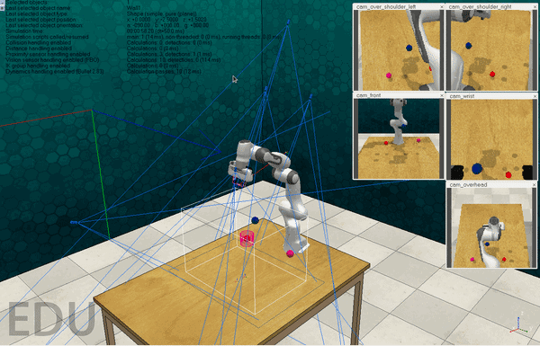
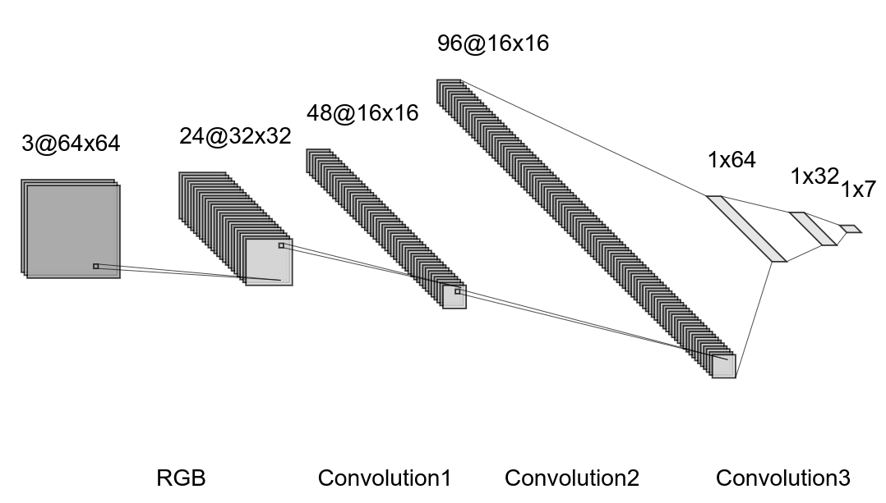

# Vision-based Manipulator Control
The objective is to move a 7DoF robotic manipulator towards a red target ball based on 5 RGB images. The agents learn to output the correct joint velocity commands based on demonstration datasets (immitation learning). The dataset is generated using coppeliasim, PyRep, and RLbench. The repo contains a script to create the dataset, various NN models created with PyTorch and a script for online evaluation of differnt models to estimate a success rate. An episode is considered successful if the robot is within a threshold distance of the target withing a timeout. **This project was originally completed in August 2023 as a part of a private GitLab repo and later moved to GitHub, hence the lack of commit history.**

## CNN+FCN model successful episode after training


## Setup and dependencies
In the following a number of dependencies have to be resolved. It is recommended to use a conda environment where possible.

## Coppeliasim
Install coppeliasim version 4.1

## Conda Env
```
conda create --name fhcr-task23
```
## PyRep
Follow https://github.com/stepjam/PyRep.git

## install RLbench 1.1.0
Follow https://github.com/stepjam/RLBench.git

## Generate Dataset
Run `generate_dataset.py` Be wary of memory limitations in case of large episode count. For large datasets it's best to run multiple times through a bash script.

## Combine Dataset
`combine_dataset.py` merges smaller datasets into a single file.

## Training
Upload the dataset, train.ipynb, and models to colab and configure the training notebook for the chosen network. There might be a need to adjust relative paths and batch sizes. Training will stop after the specified number of epochs or if no improvement in test loss is seen after a specified number of epochs.

## Evaluation
Download the trained model with the param checkpoints and use `estimate_success_rate.py` to perform online evaluation.

## Results
The following cnn_fcn_64x64 model achieved a higher success rate at ~80% compared to alexnet's ~20%. (maxpool, Relu, and batch norm have been omitted)


## Why not RL?
No GPU was available during this short project and immitation learning was the only way to use colab. (CoppeliaSim can't be installed on colab)